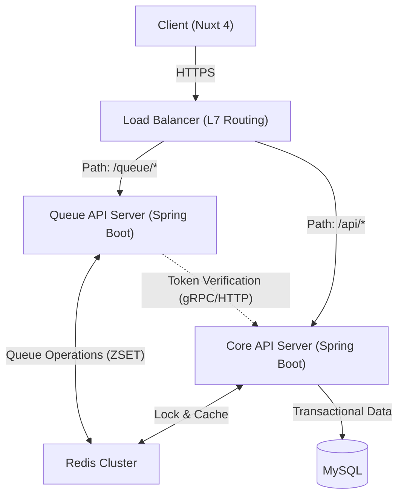
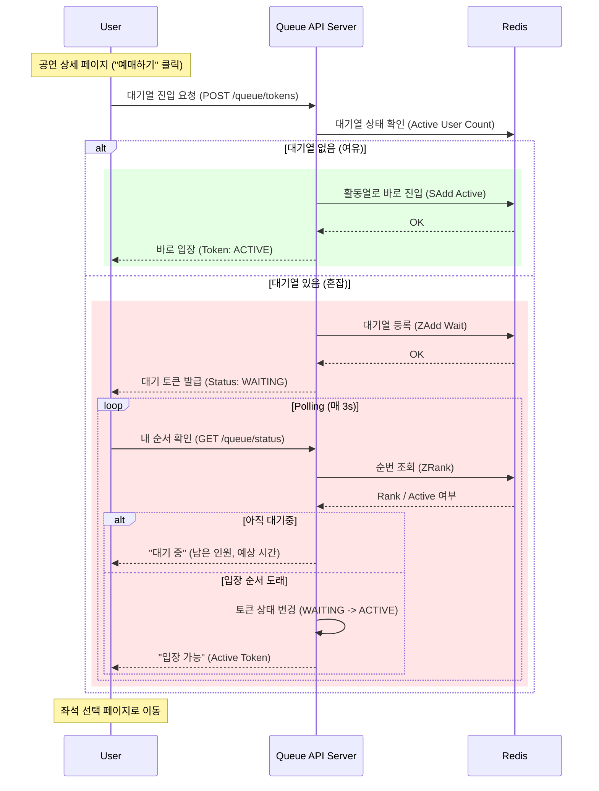
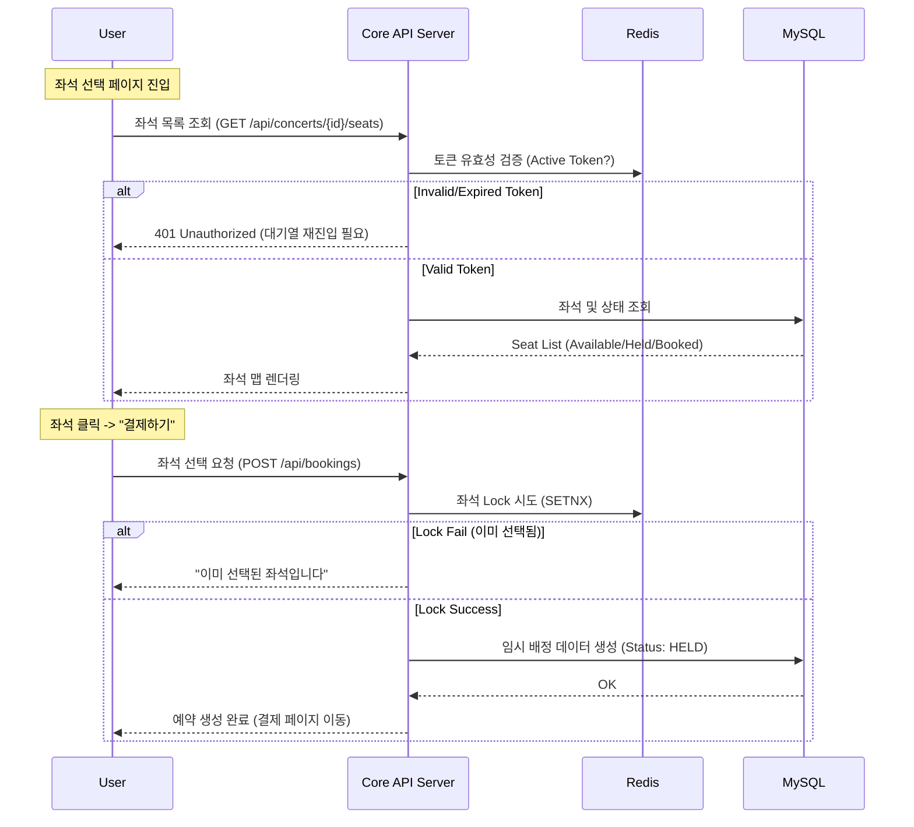
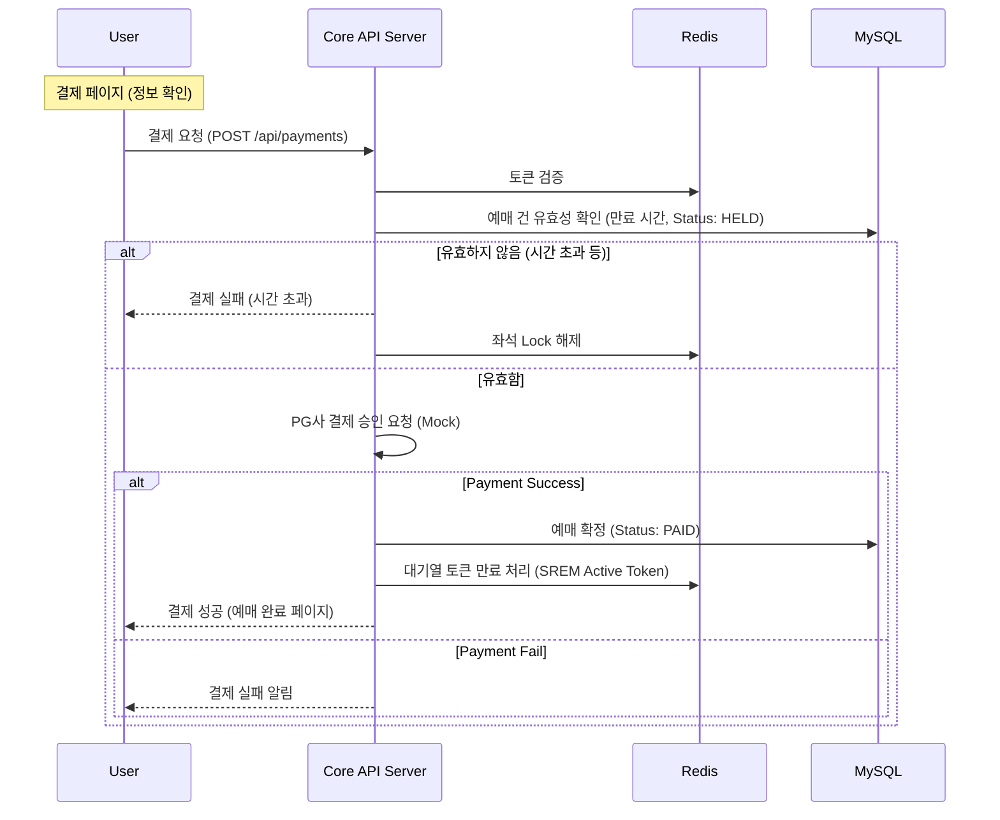
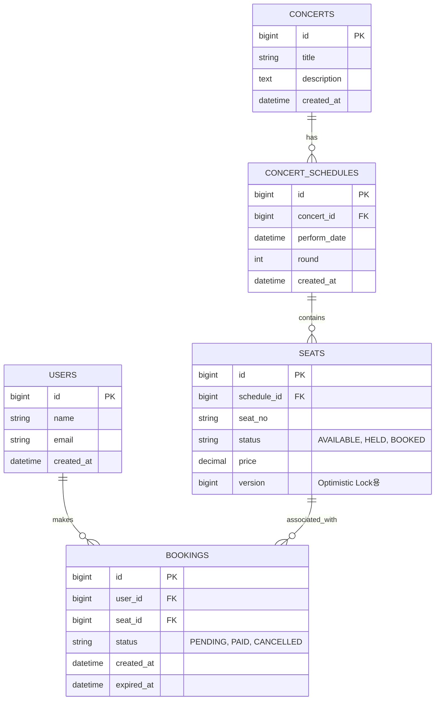

# 아키텍처 설계서 (System Architecture Design)

## 1. 시스템 아키텍처 (System Architecture)



---

## 2. 프로세스 흐름도 (Sequence Diagrams)

### 2.0. 사용자 플로우 (User Flow)
1.  **공연 목록/상세 (Concert List/Detail)**: 공연 목록 확인 후 특정 공연 상세 페이지로 이동.
2.  **대기열 진입 (Enter Queue)**: 상세 페이지에서 "예매하기" 버튼 클릭 시 대기열 토큰 발급 및 진입.
3.  **대기 (Waiting)**: 대기열 페이지에서 자신의 순서 대기. (순번 도래 시 좌석 선택 페이지로 이동)
4.  **좌석 선택 (Seat Selection)**: 좌석 선택 페이지에서 좌석 지정 후 "결제하기" 버튼 클릭 (임시 배정).
5.  **결제 (Payment)**: 결제 페이지에서 결제 진행 및 완료 (최종 확정).

### 2.1. 대기열 진입 및 대기 (Queue Flow)
> **Step 2 ~ 3**: 공연 상세 -> 대기열 -> 좌석 선택 진입 전



### 2.2. 좌석 조회 및 선택 (Seat Selection Flow)
> **Step 4**: 좌석 선택 페이지 -> 좌석 임시 배정



### 2.3. 결제 (Payment Flow)
> **Step 5**: 결제 페이지 -> 결제 완료



---

## 3. 데이터베이스 설계 (ERD)



### 3.1. 주요 컬럼 및 상태 설명 (Schema Details)

*   **`SEATS.version` (낙관적 락)**:
    - **목적**: 동시성 제어를 위한 버전 관리 컬럼.
    - **내용**: 다수의 사용자가 동시에 같은 좌석을 선점하려 할 때, `UPDATE ... WHERE version={ver}` 쿼리를 통해 최초의 요청만 성공시키고 나머지는 실패하도록 보장합니다.

*   **`SEATS.status` (좌석 상태)**:
    - **AVAILABLE**: 예약 가능한 빈 좌석.
    - **HELD (임시 배정)**: 사용자가 "좌석 선택"을 완료하고 **결제 대기 중**인 상태. (타임아웃 5~10분 적용)
    - **BOOKED (예약 확정)**: 결제가 완료되어 최종적으로 소유권이 넘어간 상태.

### 3.2. Redis 데이터 설계 및 접근 패턴 (Redis Data Design)

| Key Pattern | Type | Expiration (TTL) | 설명 (Purpose) | Access Pattern (Command) |
| :--- | :--- | :--- | :--- | :--- |
| `queue:wait:{concertId}` | Sorted Set | - | 대기열 (점수=타임스탬프) | `ZADD` (입장), `ZRANK` (순번 조회), `ZPOPMIN` (토큰 발급) |
| `queue:active:{concertId}` | Set | 10분~30분 | 입장 완료 토큰 (유효성 검증용) | `SADD` (토큰 활성화), `SISMEMBER` (유효성 체크), `SREM` (만료/퇴장) |
| `seat:lock:{seatId}` | String | 5분 | 좌석 선점 Lock (Value=UserId) | `SETNX` (락 획득), `GET` (소유자 확인), `DEL` (해제) |

#### 💡 접근 패턴 (Access Patterns)
1.  **대기열 진입**: `ZADD queue:wait:1 {timestamp} {userId}`
2.  **순번 조회**: `ZRANK queue:wait:1 {userId}`
3.  **토큰 활성화 (N명 입장)**:
    - `ZPOPMIN queue:wait:1 {N}` -> `SADD queue:active:1 {userId...}`
4.  **토큰 검증**: `SISMEMBER queue:active:1 {userId}` -> `True/False`
5.  **좌석 선점**: `SET seat:lock:5A-13 user_123 NX EX 300` (5분 TTL, 성공 시 1 반환)

---

## 4. 프로젝트 폴더 구조 (Project Directory Structure)

### 4.1. Frontend (Nuxt 4 Structure)
```
frontend/
├── app/                    # Nuxt 4 Application Directory
│   ├── assets/             # Global Assets (CSS, Fonts)
│   ├── components/         # Auto-imported Components
│   ├── composables/        # Auto-imported Composables
│   ├── layouts/            # Layouts
│   ├── pages/              # File-based Routing
│   │   ├── index.vue
│   │   ├── concerts/
│   │   │   ├── index.vue
│   │   │   └── [id].vue
│   │   └── booking/
│   ├── plugins/            # Plugins
│   ├── utils/              # Utils
│   ├── app.vue             # Root Component
│   └── router.options.ts   # Router Options
├── public/                 # Static Files
├── server/                 # Server Routes (Nitro)
├── stores/                 # Pinia Stores (Optional: can be in app/stores)
├── nuxt.config.ts          # Nuxt Configuration
└── package.json
```

### 4.2. Backend (Spring Boot 3 - Multi Module)
```
backend/
├── build.gradle        # Root Gradle
├── settings.gradle
├── ticket-core/        # Shared Domain, Entities, Utils
│   └── src/main/java/com/ticket/core/
│       ├── domain/
│       └── infrastructure/
├── ticket-queue-api/   # Queue Server (Redis Heavy)
│   └── src/main/java/com/ticket/queue/
│       └── controller/QueueController.java
└── ticket-app-api/     # Core Business Server (MySQL Heavy)
    └── src/main/java/com/ticket/api/
        ├── controller/
        └── service/
```

---

## 5. 기술적 트레이드오프: 대기열 아키텍처 (Technical Trade-offs: Queue Build Strategy)

| 방식 | 1. 단일 API 서버 (Monolithic) | 2. 별도 대기열 서버 분리 (Dedicated Queue Server) |
| :--- | :--- | :--- |
| **구조** | 하나의 서버에서 대기열 진입, 조회, 메인 비즈니스 로직을 모두 처리. | 대기열 처리 전용 서버와 메인 비즈니스 서버를 물리적/논리적으로 분리. |
| **장점** | - **구현 단순성**: 프로젝트 구조가 하나라 개발/배포가 간편.<br>- **비용 절감**: 인프라 리소스가 적게 듬. | - **장애 격리**: 대기열 트래픽 폭주로 서버가 다운되어도 이미 입장한 유저의 결제/예매는 안전.<br>- **스케일링 유연성**: Redis I/O 중심인 큐 서버와 CPU/DB 중심인 API 서버를 각각 최적화 가능. |
| **단점** | - **장애 전파**: 대기열 트래픽(단순 조회)이 폭주하면 CPU/Memory를 점유하여 결제 등 핵심 로직까지 마비됨.<br>- **확장성 한계**: 대기열만 늘리고 싶은데 전체 서버를 증설해야 함. | - **운영 복잡도**: 배포 단위가 2개가 되며, 관리 포인트 증가.<br>- **통신 비용**: 서버 간 통신이 필요한 경우 로직이 복잡해질 수 있음 (본 설계에서는 DB/Redis 공유로 해결). |
| **권장** | | **✅ 별도 대기열 서버 분리** |
| **이유** | 10만 명의 대기열 트래픽은 단순 조회(Polling)가 주를 이루므로, 이를 메인 비즈니스 로직과 섞으면 핵심 트랜잭션(결제, 예매)의 안정성을 보장하기 어려움. 따라서 안정성을 최우선으로 하여 역할을 분리하는 것이 바람직함. |

---


